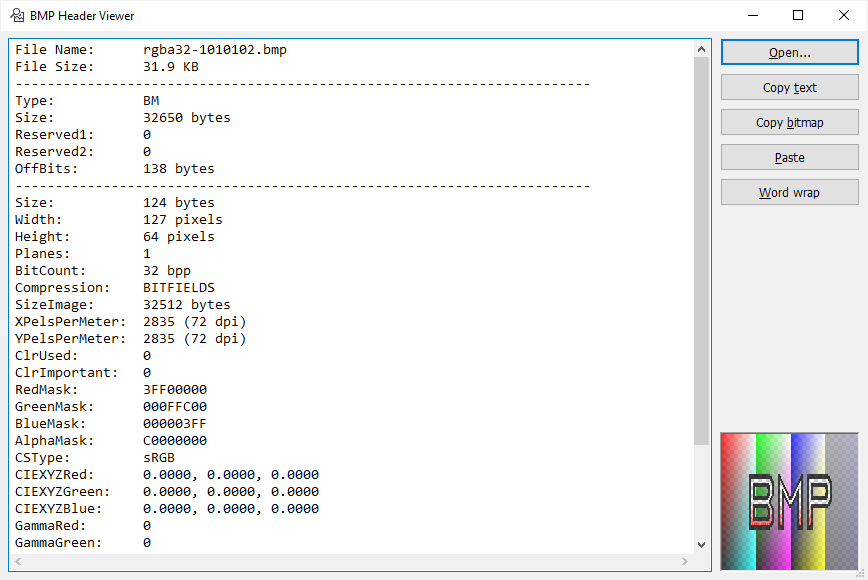

# BMP Header Viewer

## Windows Bitmap (header) viewer application

BMP Header Viewer is a small Windows application that displays the headers and metadata of Windows Bitmap files of almost all formats.  
The DIB contained in the BMP file is displayed using Windows GDI or Video for Windows. An alpha channel and limited color management are supported. The application supports the transfer of bitmaps via the clipboard. It is also possible to print a bitmap and export the ICC profile of a BMP file.

<p>
<picture>
<source media="(prefers-color-scheme: dark)" srcset="BmpHeaderViewer.dark.png">
<source media="(prefers-color-scheme: light)" srcset="BmpHeaderViewer.light.png">

</picture>
</p>

## Sample output

<details>

<summary>Output of a grayscale bitmap with an embedded color profile</summary>

```
File Name:	Grayscale.bmp
File Size:	5.46 KB
------------------------------------------------------------------------
Type:		BM
Size:		5594 bytes
Reserved1:	0
Reserved2:	0
OffBits:	1162 bytes
------------------------------------------------------------------------
Size:		124 bytes
Width:		80 pixels
Height:		50 pixels
Planes:		1
BitCount:	8 bpp
Compression:	RGB
SizeImage:	0 bytes
XPelsPerMeter:	0
YPelsPerMeter:	0
ClrUsed:	256
ClrImportant:	0
RedMask:	00000000
GreenMask:	00000000
BlueMask:	00000000
AlphaMask:	00000000
CSType:		MBED
CIEXYZRed:	0.0000, 0.0000, 0.0000
CIEXYZGreen:	0.0000, 0.0000, 0.0000
CIEXYZBlue:	0.0000, 0.0000, 0.0000
GammaRed:	0
GammaGreen:	0
GammaBlue:	0
Intent:		GM_IMAGES (Perceptual)
ProfileData:	5148 bytes
ProfileSize:	432 bytes
Reserved:	0
------------------------------------------------------------------------
  I|   B   G   R   X |I | B  G  R  X  |
  0|   0   0   0   0 |00| 00 00 00 00 | black
  1|   1   1   1   0 |01| 01 01 01 00 |
  2|   2   2   2   0 |02| 02 02 02 00 |
  3|   3   3   3   0 |03| 03 03 03 00 |
  4|   4   4   4   0 |04| 04 04 04 00 |
  5|   5   5   5   0 |05| 05 05 05 00 |
  6|   6   6   6   0 |06| 06 06 06 00 |
  7|   7   7   7   0 |07| 07 07 07 00 |
  8|   8   8   8   0 |08| 08 08 08 00 |
  9|   9   9   9   0 |09| 09 09 09 00 |
 10|  10  10  10   0 |0A| 0A 0A 0A 00 |
 11|  11  11  11   0 |0B| 0B 0B 0B 00 |
 12|  12  12  12   0 |0C| 0C 0C 0C 00 |
 13|  13  13  13   0 |0D| 0D 0D 0D 00 |
 14|  14  14  14   0 |0E| 0E 0E 0E 00 |
 15|  15  15  15   0 |0F| 0F 0F 0F 00 |
 16|  16  16  16   0 |10| 10 10 10 00 |
 17|  17  17  17   0 |11| 11 11 11 00 |
 18|  18  18  18   0 |12| 12 12 12 00 |
 19|  19  19  19   0 |13| 13 13 13 00 |
 20|  20  20  20   0 |14| 14 14 14 00 |
 21|  21  21  21   0 |15| 15 15 15 00 |
 22|  22  22  22   0 |16| 16 16 16 00 |
 23|  23  23  23   0 |17| 17 17 17 00 |
 24|  24  24  24   0 |18| 18 18 18 00 |
 25|  25  25  25   0 |19| 19 19 19 00 |
 26|  26  26  26   0 |1A| 1A 1A 1A 00 |
 27|  27  27  27   0 |1B| 1B 1B 1B 00 |
 28|  28  28  28   0 |1C| 1C 1C 1C 00 |
 29|  29  29  29   0 |1D| 1D 1D 1D 00 |
 30|  30  30  30   0 |1E| 1E 1E 1E 00 |
 31|  31  31  31   0 |1F| 1F 1F 1F 00 |
 32|  32  32  32   0 |20| 20 20 20 00 |
 33|  33  33  33   0 |21| 21 21 21 00 |
 34|  34  34  34   0 |22| 22 22 22 00 |
 35|  35  35  35   0 |23| 23 23 23 00 |
 36|  36  36  36   0 |24| 24 24 24 00 |
 37|  37  37  37   0 |25| 25 25 25 00 |
 38|  38  38  38   0 |26| 26 26 26 00 |
 39|  39  39  39   0 |27| 27 27 27 00 |
 40|  40  40  40   0 |28| 28 28 28 00 |
 41|  41  41  41   0 |29| 29 29 29 00 |
 42|  42  42  42   0 |2A| 2A 2A 2A 00 |
 43|  43  43  43   0 |2B| 2B 2B 2B 00 |
 44|  44  44  44   0 |2C| 2C 2C 2C 00 |
 45|  45  45  45   0 |2D| 2D 2D 2D 00 |
 46|  46  46  46   0 |2E| 2E 2E 2E 00 |
 47|  47  47  47   0 |2F| 2F 2F 2F 00 |
 48|  48  48  48   0 |30| 30 30 30 00 |
 49|  49  49  49   0 |31| 31 31 31 00 |
 50|  50  50  50   0 |32| 32 32 32 00 |
 51|  51  51  51   0 |33| 33 33 33 00 |
 52|  52  52  52   0 |34| 34 34 34 00 |
 53|  53  53  53   0 |35| 35 35 35 00 |
 54|  54  54  54   0 |36| 36 36 36 00 |
 55|  55  55  55   0 |37| 37 37 37 00 |
 56|  56  56  56   0 |38| 38 38 38 00 |
 57|  57  57  57   0 |39| 39 39 39 00 |
 58|  58  58  58   0 |3A| 3A 3A 3A 00 |
 59|  59  59  59   0 |3B| 3B 3B 3B 00 |
 60|  60  60  60   0 |3C| 3C 3C 3C 00 |
 61|  61  61  61   0 |3D| 3D 3D 3D 00 |
 62|  62  62  62   0 |3E| 3E 3E 3E 00 |
 63|  63  63  63   0 |3F| 3F 3F 3F 00 |
 64|  64  64  64   0 |40| 40 40 40 00 |
 65|  65  65  65   0 |41| 41 41 41 00 |
 66|  66  66  66   0 |42| 42 42 42 00 |
 67|  67  67  67   0 |43| 43 43 43 00 |
 68|  68  68  68   0 |44| 44 44 44 00 |
 69|  69  69  69   0 |45| 45 45 45 00 |
 70|  70  70  70   0 |46| 46 46 46 00 |
 71|  71  71  71   0 |47| 47 47 47 00 |
 72|  72  72  72   0 |48| 48 48 48 00 |
 73|  73  73  73   0 |49| 49 49 49 00 |
 74|  74  74  74   0 |4A| 4A 4A 4A 00 |
 75|  75  75  75   0 |4B| 4B 4B 4B 00 |
 76|  76  76  76   0 |4C| 4C 4C 4C 00 |
 77|  77  77  77   0 |4D| 4D 4D 4D 00 |
 78|  78  78  78   0 |4E| 4E 4E 4E 00 |
 79|  79  79  79   0 |4F| 4F 4F 4F 00 |
 80|  80  80  80   0 |50| 50 50 50 00 |
 81|  81  81  81   0 |51| 51 51 51 00 |
 82|  82  82  82   0 |52| 52 52 52 00 |
 83|  83  83  83   0 |53| 53 53 53 00 |
 84|  84  84  84   0 |54| 54 54 54 00 |
 85|  85  85  85   0 |55| 55 55 55 00 |
 86|  86  86  86   0 |56| 56 56 56 00 |
 87|  87  87  87   0 |57| 57 57 57 00 |
 88|  88  88  88   0 |58| 58 58 58 00 |
 89|  89  89  89   0 |59| 59 59 59 00 |
 90|  90  90  90   0 |5A| 5A 5A 5A 00 |
 91|  91  91  91   0 |5B| 5B 5B 5B 00 |
 92|  92  92  92   0 |5C| 5C 5C 5C 00 |
 93|  93  93  93   0 |5D| 5D 5D 5D 00 |
 94|  94  94  94   0 |5E| 5E 5E 5E 00 |
 95|  95  95  95   0 |5F| 5F 5F 5F 00 |
 96|  96  96  96   0 |60| 60 60 60 00 |
 97|  97  97  97   0 |61| 61 61 61 00 |
 98|  98  98  98   0 |62| 62 62 62 00 |
 99|  99  99  99   0 |63| 63 63 63 00 |
100| 100 100 100   0 |64| 64 64 64 00 |
101| 101 101 101   0 |65| 65 65 65 00 |
102| 102 102 102   0 |66| 66 66 66 00 |
103| 103 103 103   0 |67| 67 67 67 00 |
104| 104 104 104   0 |68| 68 68 68 00 |
105| 105 105 105   0 |69| 69 69 69 00 |
106| 106 106 106   0 |6A| 6A 6A 6A 00 |
107| 107 107 107   0 |6B| 6B 6B 6B 00 |
108| 108 108 108   0 |6C| 6C 6C 6C 00 |
109| 109 109 109   0 |6D| 6D 6D 6D 00 |
110| 110 110 110   0 |6E| 6E 6E 6E 00 |
111| 111 111 111   0 |6F| 6F 6F 6F 00 |
112| 112 112 112   0 |70| 70 70 70 00 |
113| 113 113 113   0 |71| 71 71 71 00 |
114| 114 114 114   0 |72| 72 72 72 00 |
115| 115 115 115   0 |73| 73 73 73 00 |
116| 116 116 116   0 |74| 74 74 74 00 |
117| 117 117 117   0 |75| 75 75 75 00 |
118| 118 118 118   0 |76| 76 76 76 00 |
119| 119 119 119   0 |77| 77 77 77 00 |
120| 120 120 120   0 |78| 78 78 78 00 |
121| 121 121 121   0 |79| 79 79 79 00 |
122| 122 122 122   0 |7A| 7A 7A 7A 00 |
123| 123 123 123   0 |7B| 7B 7B 7B 00 |
124| 124 124 124   0 |7C| 7C 7C 7C 00 |
125| 125 125 125   0 |7D| 7D 7D 7D 00 |
126| 126 126 126   0 |7E| 7E 7E 7E 00 |
127| 127 127 127   0 |7F| 7F 7F 7F 00 |
128| 128 128 128   0 |80| 80 80 80 00 | medium gray
129| 129 129 129   0 |81| 81 81 81 00 |
130| 130 130 130   0 |82| 82 82 82 00 |
131| 131 131 131   0 |83| 83 83 83 00 |
132| 132 132 132   0 |84| 84 84 84 00 |
133| 133 133 133   0 |85| 85 85 85 00 |
134| 134 134 134   0 |86| 86 86 86 00 |
135| 135 135 135   0 |87| 87 87 87 00 |
136| 136 136 136   0 |88| 88 88 88 00 |
137| 137 137 137   0 |89| 89 89 89 00 |
138| 138 138 138   0 |8A| 8A 8A 8A 00 |
139| 139 139 139   0 |8B| 8B 8B 8B 00 |
140| 140 140 140   0 |8C| 8C 8C 8C 00 |
141| 141 141 141   0 |8D| 8D 8D 8D 00 |
142| 142 142 142   0 |8E| 8E 8E 8E 00 |
143| 143 143 143   0 |8F| 8F 8F 8F 00 |
144| 144 144 144   0 |90| 90 90 90 00 |
145| 145 145 145   0 |91| 91 91 91 00 |
146| 146 146 146   0 |92| 92 92 92 00 |
147| 147 147 147   0 |93| 93 93 93 00 |
148| 148 148 148   0 |94| 94 94 94 00 |
149| 149 149 149   0 |95| 95 95 95 00 |
150| 150 150 150   0 |96| 96 96 96 00 |
151| 151 151 151   0 |97| 97 97 97 00 |
152| 152 152 152   0 |98| 98 98 98 00 |
153| 153 153 153   0 |99| 99 99 99 00 |
154| 154 154 154   0 |9A| 9A 9A 9A 00 |
155| 155 155 155   0 |9B| 9B 9B 9B 00 |
156| 156 156 156   0 |9C| 9C 9C 9C 00 |
157| 157 157 157   0 |9D| 9D 9D 9D 00 |
158| 158 158 158   0 |9E| 9E 9E 9E 00 |
159| 159 159 159   0 |9F| 9F 9F 9F 00 |
160| 160 160 160   0 |A0| A0 A0 A0 00 |
161| 161 161 161   0 |A1| A1 A1 A1 00 |
162| 162 162 162   0 |A2| A2 A2 A2 00 |
163| 163 163 163   0 |A3| A3 A3 A3 00 |
164| 164 164 164   0 |A4| A4 A4 A4 00 |
165| 165 165 165   0 |A5| A5 A5 A5 00 |
166| 166 166 166   0 |A6| A6 A6 A6 00 |
167| 167 167 167   0 |A7| A7 A7 A7 00 |
168| 168 168 168   0 |A8| A8 A8 A8 00 |
169| 169 169 169   0 |A9| A9 A9 A9 00 |
170| 170 170 170   0 |AA| AA AA AA 00 |
171| 171 171 171   0 |AB| AB AB AB 00 |
172| 172 172 172   0 |AC| AC AC AC 00 |
173| 173 173 173   0 |AD| AD AD AD 00 |
174| 174 174 174   0 |AE| AE AE AE 00 |
175| 175 175 175   0 |AF| AF AF AF 00 |
176| 176 176 176   0 |B0| B0 B0 B0 00 |
177| 177 177 177   0 |B1| B1 B1 B1 00 |
178| 178 178 178   0 |B2| B2 B2 B2 00 |
179| 179 179 179   0 |B3| B3 B3 B3 00 |
180| 180 180 180   0 |B4| B4 B4 B4 00 |
181| 181 181 181   0 |B5| B5 B5 B5 00 |
182| 182 182 182   0 |B6| B6 B6 B6 00 |
183| 183 183 183   0 |B7| B7 B7 B7 00 |
184| 184 184 184   0 |B8| B8 B8 B8 00 |
185| 185 185 185   0 |B9| B9 B9 B9 00 |
186| 186 186 186   0 |BA| BA BA BA 00 |
187| 187 187 187   0 |BB| BB BB BB 00 |
188| 188 188 188   0 |BC| BC BC BC 00 |
189| 189 189 189   0 |BD| BD BD BD 00 |
190| 190 190 190   0 |BE| BE BE BE 00 |
191| 191 191 191   0 |BF| BF BF BF 00 |
192| 192 192 192   0 |C0| C0 C0 C0 00 | light gray
193| 193 193 193   0 |C1| C1 C1 C1 00 |
194| 194 194 194   0 |C2| C2 C2 C2 00 |
195| 195 195 195   0 |C3| C3 C3 C3 00 |
196| 196 196 196   0 |C4| C4 C4 C4 00 |
197| 197 197 197   0 |C5| C5 C5 C5 00 |
198| 198 198 198   0 |C6| C6 C6 C6 00 |
199| 199 199 199   0 |C7| C7 C7 C7 00 |
200| 200 200 200   0 |C8| C8 C8 C8 00 |
201| 201 201 201   0 |C9| C9 C9 C9 00 |
202| 202 202 202   0 |CA| CA CA CA 00 |
203| 203 203 203   0 |CB| CB CB CB 00 |
204| 204 204 204   0 |CC| CC CC CC 00 |
205| 205 205 205   0 |CD| CD CD CD 00 |
206| 206 206 206   0 |CE| CE CE CE 00 |
207| 207 207 207   0 |CF| CF CF CF 00 |
208| 208 208 208   0 |D0| D0 D0 D0 00 |
209| 209 209 209   0 |D1| D1 D1 D1 00 |
210| 210 210 210   0 |D2| D2 D2 D2 00 |
211| 211 211 211   0 |D3| D3 D3 D3 00 |
212| 212 212 212   0 |D4| D4 D4 D4 00 |
213| 213 213 213   0 |D5| D5 D5 D5 00 |
214| 214 214 214   0 |D6| D6 D6 D6 00 |
215| 215 215 215   0 |D7| D7 D7 D7 00 |
216| 216 216 216   0 |D8| D8 D8 D8 00 |
217| 217 217 217   0 |D9| D9 D9 D9 00 |
218| 218 218 218   0 |DA| DA DA DA 00 |
219| 219 219 219   0 |DB| DB DB DB 00 |
220| 220 220 220   0 |DC| DC DC DC 00 |
221| 221 221 221   0 |DD| DD DD DD 00 |
222| 222 222 222   0 |DE| DE DE DE 00 |
223| 223 223 223   0 |DF| DF DF DF 00 |
224| 224 224 224   0 |E0| E0 E0 E0 00 |
225| 225 225 225   0 |E1| E1 E1 E1 00 |
226| 226 226 226   0 |E2| E2 E2 E2 00 |
227| 227 227 227   0 |E3| E3 E3 E3 00 |
228| 228 228 228   0 |E4| E4 E4 E4 00 |
229| 229 229 229   0 |E5| E5 E5 E5 00 |
230| 230 230 230   0 |E6| E6 E6 E6 00 |
231| 231 231 231   0 |E7| E7 E7 E7 00 |
232| 232 232 232   0 |E8| E8 E8 E8 00 |
233| 233 233 233   0 |E9| E9 E9 E9 00 |
234| 234 234 234   0 |EA| EA EA EA 00 |
235| 235 235 235   0 |EB| EB EB EB 00 |
236| 236 236 236   0 |EC| EC EC EC 00 |
237| 237 237 237   0 |ED| ED ED ED 00 |
238| 238 238 238   0 |EE| EE EE EE 00 |
239| 239 239 239   0 |EF| EF EF EF 00 |
240| 240 240 240   0 |F0| F0 F0 F0 00 |
241| 241 241 241   0 |F1| F1 F1 F1 00 |
242| 242 242 242   0 |F2| F2 F2 F2 00 |
243| 243 243 243   0 |F3| F3 F3 F3 00 |
244| 244 244 244   0 |F4| F4 F4 F4 00 |
245| 245 245 245   0 |F5| F5 F5 F5 00 |
246| 246 246 246   0 |F6| F6 F6 F6 00 |
247| 247 247 247   0 |F7| F7 F7 F7 00 |
248| 248 248 248   0 |F8| F8 F8 F8 00 |
249| 249 249 249   0 |F9| F9 F9 F9 00 |
250| 250 250 250   0 |FA| FA FA FA 00 |
251| 251 251 251   0 |FB| FB FB FB 00 |
252| 252 252 252   0 |FC| FC FC FC 00 |
253| 253 253 253   0 |FD| FD FD FD 00 |
254| 254 254 254   0 |FE| FE FE FE 00 |
255| 255 255 255   0 |FF| FF FF FF 00 | white
------------------------------------------------------------------------
ProfileSize:	432 bytes
CMMType:	ADBE
Version:	2.1.0
Class:		mntr
ColorSpace:	GRAY
PCS:		XYZ 
DateTime:	1999-06-03 00:00:00
Signature:	acsp
Platform:	MSFT
ProfileFlags:	00000000
Manufacturer:	none
Model:		0
Attributes:	0000000000000000
Intent:		RELATIVE_COLORIMETRIC
Illuminant:	0.9642, 1.0000, 0.8249
Creator:	ADBE
------------------------------------------------------------------------
TagCount:	5
------------------------------------------------------------------------
Sig. | Element Offset | Element Size |
cprt |      192 bytes |     76 bytes | Copyright (c) 1999 Adobe Systems Incorporated. All Rights Reserved.
desc |      268 bytes |    105 bytes | Gray Gamma 2.2
wtpt |      376 bytes |     20 bytes | X = 0.9505, Y = 1.0000, Z = 1.0891
bkpt |      396 bytes |     20 bytes | X = 0.0000, Y = 0.0000, Z = 0.0000
kTRC |      416 bytes |     14 bytes | Y = X ^ 2.1992
========================================================================

```
</details>

## Usage

A BMP file can be opened in various ways:

- As a command line argument
- Via the Open File dialog box
- Via drag-and-drop (multiple at once)
- Via the clipboard (multiple at once)

For performance reasons, color management is only activated if the bitmap contains color space data. Color management and transparency are mutually exclusive. You can use the context menu of the thumbnail to activate or deactivate color matching for this specific image.

A loaded bitmap can also be printed. This allows you to check how a specific DIB is displayed on a different output device.

The program can also open JPEG files. This gives you more options for experimenting with color profiles.

The font of the output window can be scaled with <kbd>CTRL</kbd>+<kbd>MOUSE SCROLL WHEEL</kbd>.

The application saves the window placement and font size in the registry. Holding down the <kbd>SHIFT</kbd> key during startup will load the default settings. The `Uninstall.reg` file contains a registry entry to remove the settings from the registry.

## Limitations

DIBs with extended BITMAPINFOHEADER fields, as described in the JPEG DIB Format Specification, are not supported.

Multiple-version format bitmaps and OS/2 2.0-style DIBs with a truncated header, as described in the Presentation Manager Programming Reference, are not supported.

The tool displays the header and tag table of an embedded color profile. Tag data is only displayed if it can be displayed in a single line. However, the profile can be exported for further examination, e.g. with the [ICC Profile Inspector](https://www.color.org/profileinspector.xalter) or using [wxProfileDump](https://www.color.org/profdump.xalter).

Standard DIBs and DIBs with DIB format extensions are displayed directly using Windows GDI. No format conversion takes place. For custom formats, the DrawDib API from Video for Windows is used. No other codec-based frameworks such as Windows Imaging Component are used.

Image color management is performed on-the-fly using [Device Context-based ICM](https://learn.microsoft.com/en-us/windows/win32/api/wingdi/nf-wingdi-seticmmode) (ICM 1.0). As ICM outside DC (ICM 2.0) is not supported, DIBs with transparent pixels are displayed without color matching. For the same reason, DIBs with linked ICC profiles are not supported. In the Color Management dialog box, profile selection, intent selection and proofing are not supported.

The dark mode of Windows 10 1809+ is only rudimentarily supported (limited to the main window).

Windows Vista or later is required to run the program.

There is no installer for the application.

## Building the project

This is a generic C/C++ Win32 desktop project created with Microsoft Visual Studio 2022.  
There are no special prerequisites or dependencies.

## License

Copyright © 2024 by W. Rolke

Licensed under the [European Union Public Licence (EUPL)](https://joinup.ec.europa.eu/software/page/eupl), Version 1.2 - see the [LICENSE.txt](LICENSE.txt) file for details.

This software is based in part on the work of the Independent JPEG Group.

The image files in the bmpsuite folder are in the public domain.

## Links

- [Bitmap Header Types](https://learn.microsoft.com/en-us/windows/win32/gdi/bitmap-header-types)
- [BMP Suite](https://entropymine.com/jason/bmpsuite/)
- [European Union Public Licence 1.1 & 1.2](https://joinup.ec.europa.eu/software/page/eupl)
- [EUPL Guidelines for users and developers](https://joinup.ec.europa.eu/collection/eupl/guidelines-users-and-developers)
- [Managing copyright information within a free software project](https://softwarefreedom.org/resources/2012/ManagingCopyrightInformation.html)
